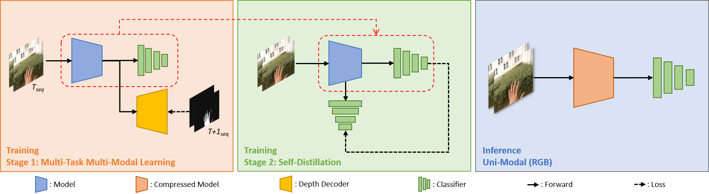
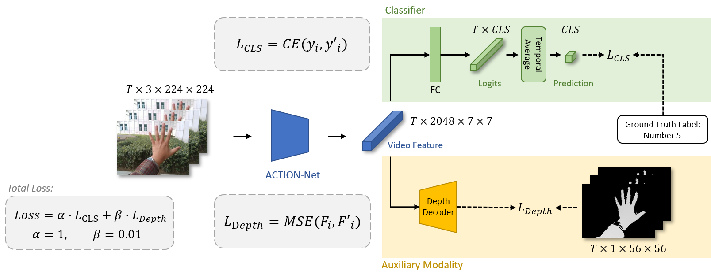
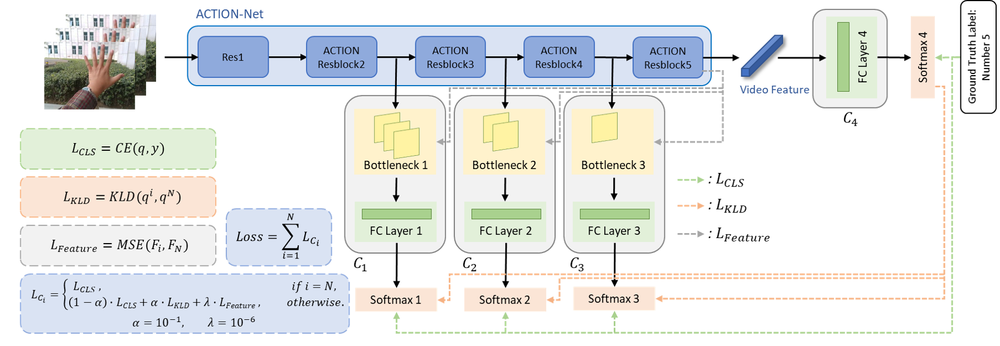

# Thesis

PyTorch implementation of the thesis ["Efficient Hand Gesture Recognition using Multi-Task Multi-Modal Learning and Self-Distillation"](https://dl.acm.org/doi/abs/10.1145/3595916.3626411). (MMAsia 2023)

## Overall Framework



## Preparation

1. run the `construct_annot()`in `dataset_EgoGesture.py` to generate the dataset.
2. run the `construct_annot()` in `dataset_NvGesture.py` to generate the dataset.

## Training

### Stage 1: Multi-Task Multi-Modal Learning (MTMM)



See the `sh/train_ego.sh` for more details.

```bash
python3 train_mtmm.py --notes MTMM ...
```

### Stage 2: Self-Distillation (SD)



See the `sh/train_ego.sh` for more details.

```bash
python3 train_sd.py --notes SD using MTMM weight ...
```

## Testing

See the `sh/test_ego.sh` for more details.

```bash
python3 test.py --note 0.01G_Predict_Next_Segment ...
```

## Citation

If you find this code useful, please consider citing our paper:

```bibtex
@inproceedings{li2023efficient,
	title={Efficient Hand Gesture Recognition using Multi-Task Multi-Modal Learning and Self-Distillation},
	author={Li, Jie-Ying and Prawiro, Herman and Chiang, Chia-Chen and Chang, Hsin-Yu and Pan, Tse-Yu and Huang, Chih-Tsun and Hu, Min-Chun},
	booktitle={ACM Multimedia Asia 2023},
	pages={1--7},
	year={2023}
}
```